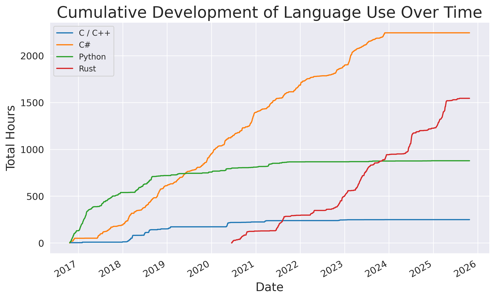
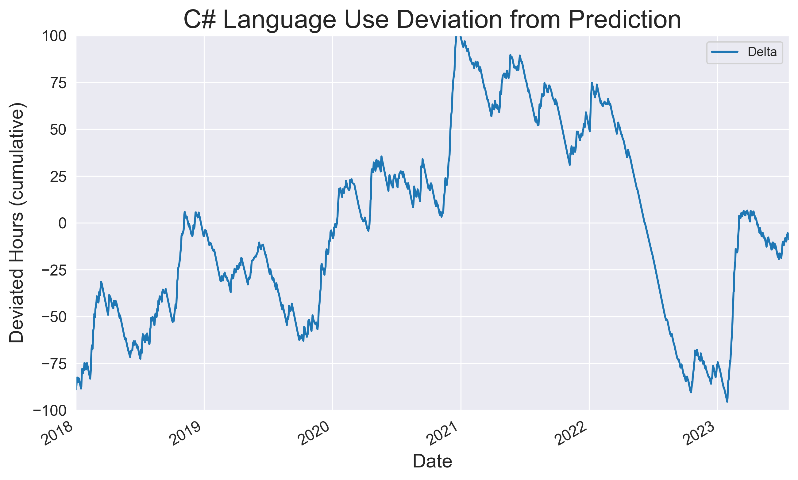

# Exploratory Analysis of my Coding Stats

A simple exploratory analysis of my coding stats. I use WakaTime since late 2016 to track my
use of programming languages and periodically fetch the daily stats from the WakaTime API (see e.g.
my [coding-stats.json Gist](https://gist.github.com/sunsided/667936bd0d4d5f042ea4e6726c5faccb)). Since
recording only started in 2016, large chunks of C#, C/C++, Matlab and other languages are missing.

In this repo, I ran some trivial analytics from the recorded history. If for whatever reason you are
interested, the `redacted.csv` contains the language-specific information. I excluded other source
data from this repo since it can hypothetically contain mildly sensitive details such as project
and machine names.

I mainly wanted to see how my Rust journey went compared to other languages and at the very least
it's interesting to say that within two-ish years of using Rust, I spent as much time
writing Rust code as I spent time writing Python code since the recording started.

The C# curve is pretty linear, which is not surprising since I have been working in .NET focused
companies from 2008 until 2025 and therefore used C# a lot during my work life. What is interesting, 
however, is that for at multiple years I had not actively assumed the role of a software developer
and _still_ maintained a linear progression there. The same story later on repeated with Rust.

This also tells a story about COVID. During the period of 2020..2022, a lot of work was done from
home. The below plot shows the deviation of my actual C# coding times from a linear regression
model (R²≈0.99) in terms of cumulative sum of programming hours. As is obvious, this number rises
both in late 2019 and late 2020, to slowly and then drastically decline in 2022. If one were to look
for symptoms of a burnout, they're right there.

There is also an interesting apparent seasonality in the deviations that would be interesting to
analyze further.
